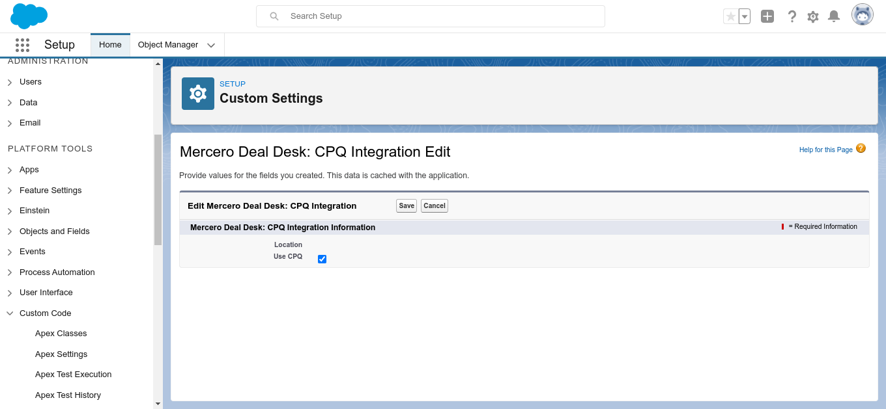
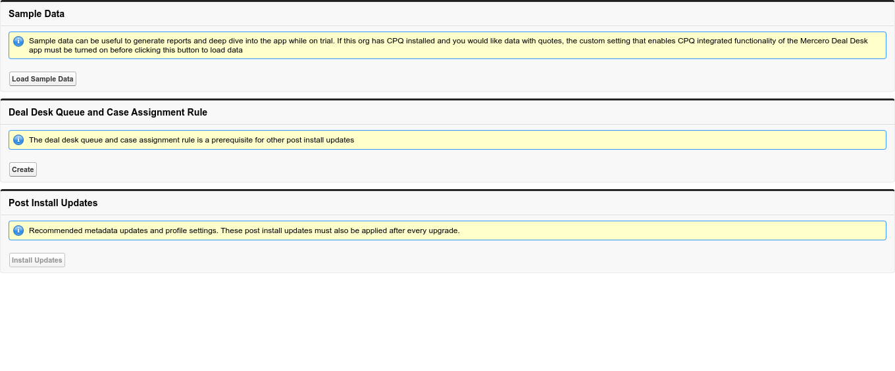

# Mercero Deal Desk - Post Install Configuration

Thanks for installing Mercero Deal Desk (MD2). Before using the app, Salesforce must be configured either manually or by using a post install script packaged and distributed with the app.

## CPQ Integration

MD2 is independent of Salesforce CPQ, but it does come with useful features derived from CPQ. In order to unlock Salesforce CPQ integrated functionality, the following custom setting will have to be set:

Setup -> Platform Tools: Custom Code -> Custom Settings -> Mercero Deal Desk: CPQ Integration  -> Manage -> New

Check "Use CPQ"

## Post Install Page

After installation of the MD2 package, recommended post install configurations can be applied using pre packaged scripts that are accessible to the System Administrator:

Setup -> Platform Tools: Custom Code -> Visualforce Pages -> Post Install

All functions provided by this page are self explanatory. However, concerns in the context of maintenance of an org are detailed below.

### Sample Data

This function is available to orgs that do not have any data - typically fresh installs on scratch orgs to be used for demos or development. In case an org has data, this button will be disabled. It can also be run only once, as the aforementioned rule that disables it would apply after one successful run.

### Deal Desk Queue and Case Assignment Rule

MD2 uses the standard Salesforce Case object. MD2 specific cases are assigned to users via a queue and case assignment rule that must be setup once after installation in order to utilize optimal case routing capabilities of MD2.

This is a one time setup. Once it runs successfully, the button will be disabled on this page.

### Post Install Updates

MD2 requires several post install meta data updates that are not amenable to Salesforce packaging. These meta data updates greatly enhance the user experience. However, they must be run each time the MD2 app is patched or upgraded to a more recent version.

As one of these updates is dependent on the Deal Desk Queue, the button remains disabled until the Deal Desk Queue and Case Assignment Rule have been created.
